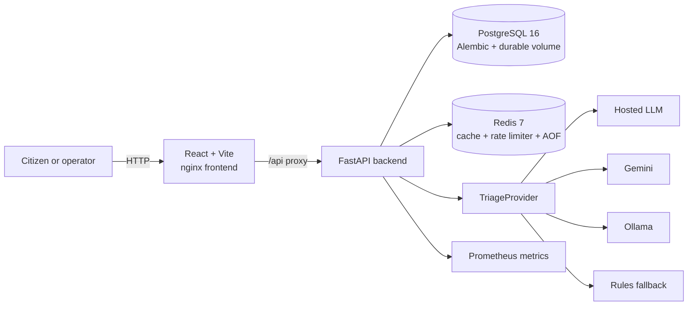

# CivicPulse

<!-- Repository: https://github.com/abdullah-netiz/CivicsPulse -->

[](https://github.com/abdullah-netiz/CivicsPulse/actions/workflows/ci.yml)
[](https://github.com/abdullah-netiz/CivicsPulse/actions/workflows/cd.yml)
[](https://github.com/abdullah-netiz/CivicsPulse/actions/workflows/release.yml)
[](LICENSE)

[](backend/pyproject.toml)
[](backend/app/main.py)
[](backend/app/schemas.py)
[](frontend/package.json)
[](frontend/tsconfig.json)
[](frontend/vite.config.ts)

[](compose.yaml)
[](compose.yaml)
[](compose.yaml)
[](k8s/base/kustomization.yaml)
[](.github/workflows/ci.yml)
[](backend/tests)
[](.github/workflows/ci.yml)

CivicPulse is a municipal complaint intake and operations system. Citizens submit free-text complaints instead of trying to classify them in a form. The backend validates each report, triages it through a replaceable provider, stores it durably, and presents the resulting category, priority, summary, and workflow status to operators.

The project demonstrates a production-shaped path from browser to API, PostgreSQL, Redis, container images, Kubernetes, and protected-branch CI/CD. It is designed around one important constraint: the triage implementation can change without changing the application services around it.

## Problem

Municipal teams receive reports such as “burst water main flooding Street 12 since fajr.” A simple chronological queue hides urgency and forces an operator to read every report before deciding what to do. CivicPulse turns that free text into structured, searchable work while keeping a deterministic rules fallback available when an external AI provider is unavailable, slow, rate-limited, or returns invalid output.

## Features

- Complaint submission with server-side and client-side validation.
- Replaceable triage providers for hosted LLMs, Ollama, deterministic rules, and CI simulation.
- Structured category, priority, summary, confidence, provider, and latency output.
- PostgreSQL persistence managed by Alembic migrations.
- Redis-backed stats caching with a 30-second TTL and `X-Cache: HIT|MISS`.
- Distributed Redis rate limiting on complaint submission with `429` and `Retry-After`.
- Paginated complaints with category, priority, and status filters.
- Explicit complaint status transitions with `409` responses for invalid transitions.
- JSON request logging, request IDs, health endpoints, and Prometheus metrics.
- Docker Compose for local development and Kubernetes manifests with probes, HPA, VPA, and ingress.
- Pull-request CI, image scanning, manifest validation, GHCR publishing, SBOM generation, and SHA-based deployment.

## Architecture



Compose separates the public `edge` network from the `internal` network. The frontend joins only `edge`; the backend joins both; PostgreSQL and Redis join only `internal`. The browser therefore reaches the API through nginx and cannot reach the data services directly.

The frontend uses nginx proxying rather than a baked-in absolute API URL, so the same frontend image can run behind different hosts. More design decisions are recorded in [docs/architecture.md](docs/architecture.md) and the [ADR directory](docs/adr/).

## Repository Layout

```text
backend/                 FastAPI application, providers, migrations, and tests
frontend/                React/Vite application and component tests
docs/                    Architecture, ADRs, runbook, notes, and evidence
k8s/                     Base manifests and dev/prod overlays
.github/workflows/       CI, CD, and release workflows
compose.yaml             Local development stack
compose.prod.yaml        Immutable-image production Compose stack
```

## Quickstart

### Requirements

- Docker Engine with Docker Compose
- Git
- For local Python checks: Python 3.12
- For Kubernetes deployment: `kubectl`, `kustomize`, and a Kubernetes cluster

### Run locally

From a clean checkout:

```bash
cp .env.example .env
docker compose up --build
```

Open <http://localhost:8080>. Compose starts PostgreSQL, Redis, the backend, and the nginx-served frontend. The backend applies Alembic migrations before serving requests. Named volumes preserve PostgreSQL data, Redis AOF data, and optional Ollama model data across restarts.

For deterministic local development and CI, use:

```dotenv
TRIAGE_PROVIDER=simulated
```

To use the offline Ollama provider, start the optional profile:

```bash
docker compose --profile offline-ai up --build
```

To stop the stack without removing data:

```bash
docker compose down
```

To remove the data volumes as well:

```bash
docker compose down -v
```

### Seed demonstration data

The seed command loads realistic complaints idempotently. Run it from the backend environment after the stack is available:

```bash
docker compose exec backend python -m app.seed
```

### Production Compose

The production file uses pre-built images and does not build from source or publish database and Redis ports:

```bash
IMAGE_TAG=$(git rev-parse HEAD) docker compose -f compose.prod.yaml up -d
```

Set `POSTGRES_PASSWORD`, registry settings, and provider credentials through the environment. Do not commit secrets.

## API

The complete interactive contract is available at <http://localhost:8080/docs> while the stack is running.

| Method | Endpoint | Description |
|:--|:--|:--|
| `POST` | `/api/complaints` | Validate, triage, rate-limit, and persist a complaint. Returns `201`. |
| `GET` | `/api/complaints` | List complaints with category, priority, status, pagination, and total count. |
| `GET` | `/api/complaints/{id}` | Retrieve one complaint. |
| `PATCH` | `/api/complaints/{id}/status` | Apply a valid status transition; invalid transitions return `409`. |
| `GET` | `/api/stats` | Return aggregate statistics and `X-Cache: HIT` or `MISS`. |
| `GET` | `/api/meta/providers` | Return the active provider and recent triage outcomes. |
| `GET` | `/health` | Liveness check that does not access the database. |
| `GET` | `/ready` | Readiness check for PostgreSQL and Redis. |
| `GET` | `/metrics` | Prometheus-compatible request and triage metrics. |

Complaint statuses follow the backend state machine:

```text
open -> in_progress -> resolved
open -> rejected
in_progress -> rejected
```

`resolved` and `rejected` are terminal states.

## Triage Providers

The provider is selected with `TRIAGE_PROVIDER` and all implementations share the same service boundary.

| Provider | Purpose |
|:--|:--|
| `llm` | Hosted LLM path with structured output validation, timeout, retry, and rules fallback. |
| `gemini` | Google Gemini provider. |
| `ollama` | Offline local model provider. |
| `rules` | Deterministic keyword-based provider. |
| `simulated` | Deterministic provider for tests and CI. |

Provider failures are recorded and safely fall back to `rules:fallback`. Provider selection and data-governance decisions are documented in [ADR 0001](docs/adr/0001-provider-interface.md) and [ADR 0004](docs/adr/0004-pii-and-data-governance.md).

## Testing and Quality Checks

Run the local checks with:

```bash
python3.12 -m compileall -q backend/app backend/alembic
docker compose config --quiet
```

Backend tests:

```bash
python3.12 -m pip install -e 'backend[test]'
cd backend
pytest --cov-fail-under=65
```

Frontend tests and build:

```bash
cd frontend
npm ci
npm test -- --run
npm run build
```

The pull-request workflow in [.github/workflows/ci.yml](.github/workflows/ci.yml) runs linting, type checks, backend and frontend tests, image builds, Trivy scans, Kubernetes manifest validation, and a Compose integration smoke test. These checks are required for merging into protected `main`.

## CI/CD and Branching

- `dev` is the integration branch for completed feature work.
- Feature branches are merged through pull requests.
- `main` contains deployable software and is protected against direct pushes.
- Pull requests into `main` require all CI checks and at least one approval.
- A push to `main` runs [CD](.github/workflows/cd.yml), publishes SHA-tagged images to GHCR, generates SBOMs, deploys an ephemeral Kubernetes validation cluster, waits for rollouts, and smoke-tests the service.
- Version tags matching `v*.*.*` are handled by [release.yml](.github/workflows/release.yml).

Production rollback procedures are documented in [docs/RUNBOOK.md](docs/RUNBOOK.md). The deployment and frontend runtime decisions are also captured in [ADR 0002](docs/adr/0002-frontend-runtime-config.md) and [ADR 0003](docs/adr/0003-deploy-by-sha.md).

## Kubernetes

Apply the production overlay to a configured cluster:

```bash
kubectl apply -k k8s/overlays/prod
kubectl rollout status deployment/backend -n civicpulse
kubectl rollout status deployment/frontend -n civicpulse
```

The manifests include a namespace, frontend and backend deployments, PostgreSQL StatefulSet and PVC, Redis, ClusterIP services, ingress routing, liveness/readiness/startup probes, resource budgets, PodDisruptionBudget, HPA, and VPA recommendations. See [docs/RUNBOOK.md](docs/RUNBOOK.md) for logs, rollback, readiness failures, and triage-provider incidents.

## Evidence and Screenshots

Evidence supporting the collaboration, CI/CD, Compose, and Kubernetes claims is stored in [docs/evidence](docs/evidence/):

| Evidence | File |
|:--|:--|
| Branch protection: PR, one approval, required checks | [branch-protection.png](docs/evidence/branch-protection.png) |
| Red CI check blocking a merge | [ci-red-blocked-merge.png](docs/evidence/ci-red-blocked-merge.png) |
| Green CI check after the fix | [ci-green.png](docs/evidence/ci-green.png) |
| Compose functional path and cache behavior | [compose-functional.txt](docs/evidence/compose-functional.txt) |
| Kubernetes autoscaling capture | [k8s-autoscaling.txt](docs/evidence/k8s-autoscaling.txt) |
| VPA recommendations | [vpa-recommendations.txt](docs/evidence/vpa-recommendations.txt) |

The screenshot files are named in [docs/evidence/README.md](docs/evidence/README.md) so each demonstration can be reproduced without putting secrets in the repository.

## Documentation

- [Architecture](docs/architecture.md)
- [Operations runbook](docs/RUNBOOK.md)
- [Engineering notes](docs/ENGINEERING-NOTES.md)
- [AI usage and provider notes](docs/AI-USAGE.md)
- [Architecture decision records](docs/adr/)
- [Evidence index](docs/evidence/README.md)

## Security Notes

Provider API keys and database passwords must come from environment variables, Kubernetes Secrets, or GitHub Secrets. They must never be committed to source, manifests, frontend bundles, screenshots, or logs. The frontend receives no provider credentials.
