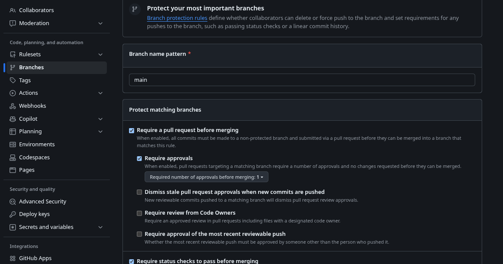
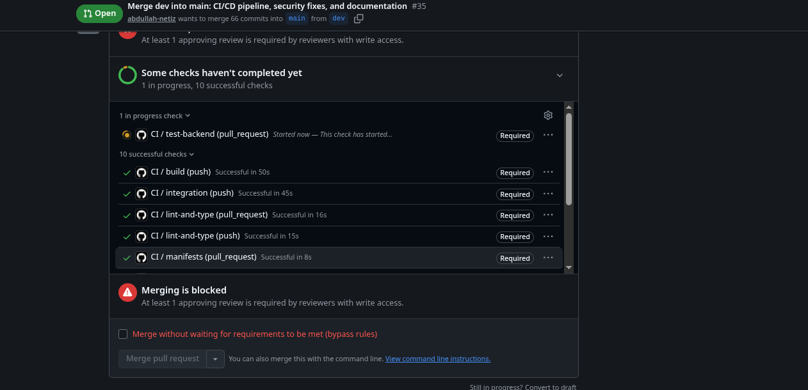
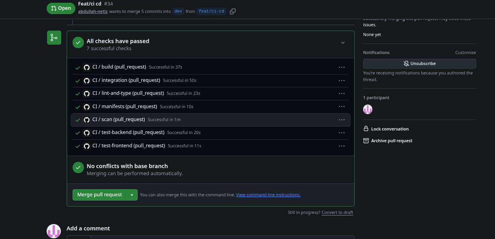
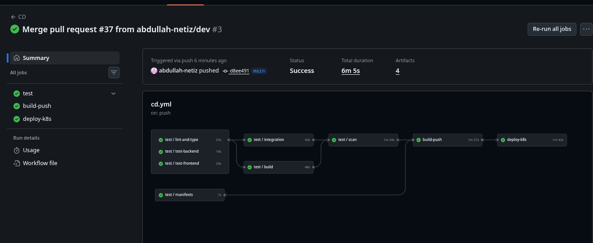

# Evidence

Screenshots and transcripts that back the collaboration, CI/CD and Kubernetes
claims in the README and the assignment rubric. Binary screenshots are stored as
`.png` and embedded below; terminal output is committed as `.txt` files next to
them.

Captured: 29 September 2026.

## Part A — Collaboration and version control

### Branch protection on `main`

The `main` branch requires a pull request before merging, one approving review,
and passing status checks — so no commit reaches `main` without review and a
green pipeline.



## Part I — CI/CD

### Red: merge is blocked until every required check passes

Pull request #35 (`dev` → `main`) while a required check is still running. The
merge button is disabled and GitHub reports *Merging is blocked*, which is the
state that stops unfinished work from reaching `main`.



### Green: every check passes

Pull request #34 with all seven CI checks green — lint/type-check, backend
tests, frontend tests, image build, Trivy scan, manifest validation, and the
Compose integration smoke test.



### Green: CD after the merge to `main`

The `cd.yml` run triggered by the push to `main`: `test` → `build-push` →
`deploy-k8s` all succeeded (6m 5s, 4 artifacts), so the images were published to
GHCR tagged by commit SHA and the ephemeral validation cluster deployed,
rolled out, and smoke-tested.



## Part H — Kubernetes / autoscaling

- [`k8s-autoscaling.txt`](k8s-autoscaling.txt) — `kubectl get pods/svc/hpa/vpa`
  plus `kubectl top pods/nodes` on the live `kind` cluster (`civicpulse`,
  namespace `civicpulse`). HPA reads `cpu: 10%/60%` from metrics-server, VPA
  reports `PROVIDED=True`, and per-pod CPU/memory is captured.
- [`vpa-recommendations.txt`](vpa-recommendations.txt) —
  `kubectl describe vpa backend-vpa` showing `RecommendationProvided=True` with
  target `cpu: 143m / memory: 250Mi` and the lower/upper confidence bounds. Mode
  is `Off` (recommendation-only), so the VPA admission webhook is intentionally
  scaled to 0 — see ADR 0001 and the engineering notes for the HPA/VPA conflict.

Regenerate both with:

```powershell
./scripts/capture_evidence.ps1
```

## Docker Compose functional demo

- [`compose-functional.txt`](compose-functional.txt) — `/health`, `/ready`,
  `/metrics` through the frontend origin (proves the nginx `/api` proxy), plus
  two consecutive `/api/stats` calls showing the Redis cache go `MISS` → `HIT`.

## Not yet captured

| Evidence | Why it is listed here |
|:--|:--|
| `direct-push-blocked.png` | Optional: a rejected `git push origin main`. |
| `pr-review-examples.png` | Merged PRs with linked issues and a substantive review comment from the other partner. |
| `git-shortlog.png` | `git shortlog -sne` showing both partners' contribution split. |
| `merge-conflict.md` | The deliberate merge conflict: markers, resolution, merge commit hash, and why the resolution won. |

<!-- Files are added as each item is completed. Do not commit secrets or real API keys. -->
